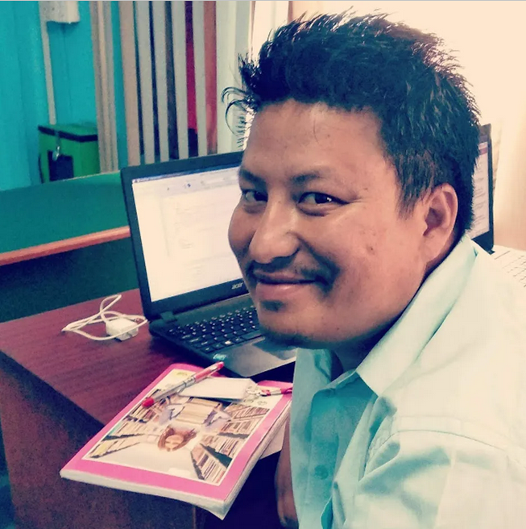
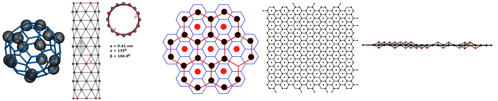

### Hi there 👋
I am Roshan Shrestha, a PhD researcher at MMSB, CNRS, Lyon. My research interests are in the computational modeling of biological macromolecules and nanomaterials, employing biophysical principles and molecular dynamics simulations to understand complex molecular systems and their interactions at the nanoscale.

<!--
**roshan2004/roshan2004** is a ✨ _special_ ✨ repository because its `README.md` (this file) appears on your GitHub profile.

Here are some ideas to get you started:

- 🔭 I’m currently working on ...
- 🌱 I’m currently learning ...
- 👯 I’m looking to collaborate on ...
- 🤔 I’m looking for help with ...
- 💬 Ask me about ...
- 📫 How to reach me: ...
- 😄 Pronouns: ...
- ⚡ Fun fact: ...
-->
# Hi there, I'm Roshan! 👋

## About Me

I am a passionate developer with a keen interest in [mention your areas of interest or expertise, e.g., web development, data science, machine learning, etc.]. I enjoy working on challenging projects and learning new technologies.

## Skills

- **Languages:** [List the programming languages you are proficient in, e.g., Python, JavaScript, Java, etc.]
- **Frameworks and Libraries:** [List the frameworks and libraries you have experience with, e.g., React, Node.js, Django, etc.]
- **Tools and Technologies:** [List the tools and technologies you use, e.g., Git, Docker, Kubernetes, etc.]
- **Databases:** [List the databases you are familiar with, e.g., MySQL, PostgreSQL, MongoDB, etc.]

## Projects

Here are a few projects I have worked on:

- [Project 1 Name](link to project repository): Brief description of what the project does.
- [Project 2 Name](link to project repository): Brief description of what the project does.
- [Project 3 Name](link to project repository): Brief description of what the project does.

## GitHub Stats

## Contact Me

- **Email:** [your email address]
- **LinkedIn:** [your LinkedIn profile link]
- **Twitter:** [your Twitter profile link]
- **Personal Website:** [your personal website link]

Feel free to reach out if you have any questions or if you want to collaborate on a project!

---

Thank you for visiting my profile! Have a great day! 😊
