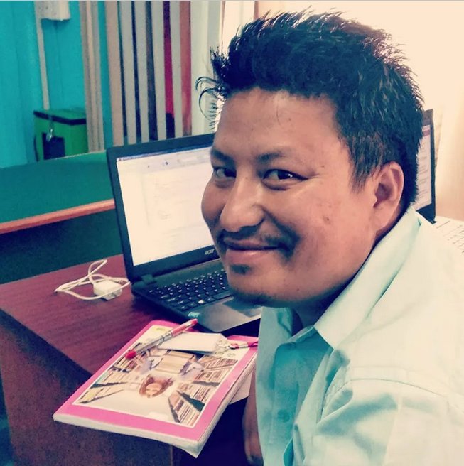
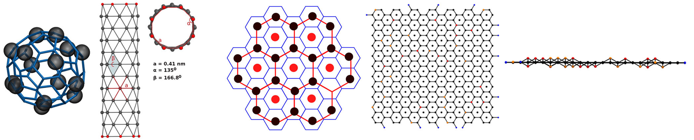

<!--
**roshan2004/roshan2004** is a ✨ _special_ ✨ repository because its `README.md` (this file) appears on your GitHub profile.

Here are some ideas to get you started:

- 🔭 I’m currently working on ...
- 🌱 I’m currently learning ...
- 👯 I’m looking to collaborate on ...
- 🤔 I’m looking for help with ...
- 💬 Ask me about ...
- 📫 How to reach me: ...
- 😄 Pronouns: ...
- ⚡ Fun fact: ...
-->
# Hi there, I'm Roshan! 👋

## About Me

I am currently a Research Engineer at Materialise NV, Leuven. Previously, I was a PhD researcher at MMSB, CNRS, Lyon. My research interests are in the computational modeling of biological macromolecules and nanomaterials, employing biophysical principles and molecular dynamics simulations to understand complex molecular systems and their interactions at the nanoscale.

## Skills

- **Languages:** Python, JavaScript, C++, Fortran
- **Databases:** MySQL

## Projects

Here are a few projects I have worked on:

- [Martini 3 Fullerene](https://github.com/MoMS-MMSB/Martini3-Fullerene): Generates a Martini 3 model of Fullerene for running the molecular dynamics simulation with the Gromacs simulation package. The script outputs both the structure file (.gro) and a topology file (.itp).
- [Martini 3 Graphene](https://github.com/MoMS-MMSB/Martini3-Graphene): Generates a Martini 3 model of both finite and infinite graphene sheet for running the molecular dynamics simulation with the Gromacs simulation package. The script outputs both the structure file (.gro) and a topology file (.itp).
- [kmers](https://github.com/roshan2004/kmers): Counting K-mers from the sequence in fasta format.

## Contact Me

- **Email:** roshanpra@gmail.com
- **LinkedIn:** https://www.linkedin.com/in/roshanshrestha2004/
- **Twitter:** https://x.com/roshan_shrestha
- **Personal Website:** https://roshan2004.github.io/

Feel free to reach out if you have any questions or if you want to collaborate on a project!

---

Thank you for visiting my profile! Have a great day! 😊
